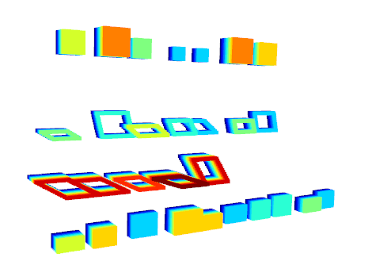

# shapes3d :large_blue_circle: :large_orange_diamond: :small_red_triangle: :red_circle:
A point cloud generator for various 3D shapes

# Usage
```
To do

```
# Example
```
To do

```




# Visualize

Visualize the generated dataset 
```
To do
```